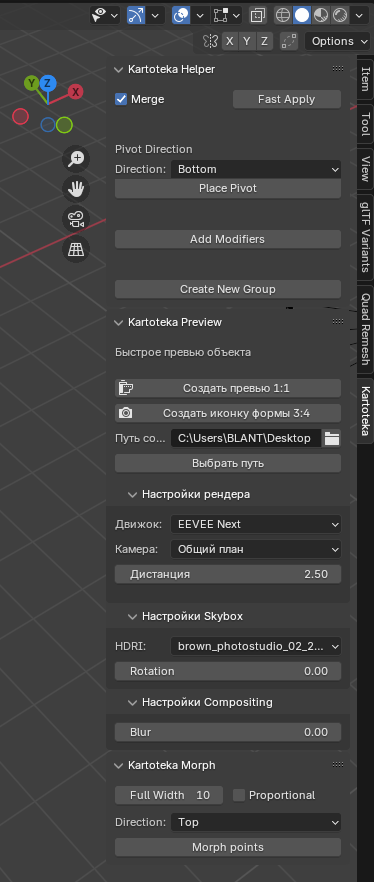

# Kartoteka Addon
Kartoteka Addon for Blender.

## Helper
- Fast Apply (All Transforms -> Unlink -> Merge By Distance) 
- Set pivot in 6 directions (Top, Bottom, Left, Right, Front, Back)
- Add 3 modifiers (Decimate Collapse [on], Decimate Planar [off], Weighted Normals [off])
- Create New Group

## Preview
- Create a 1:1 preview
- Create a form icon
- Render settings
- Skybox settings
- Compositing settings

## Morph
- Stretching points by specified parameters and start sizes
